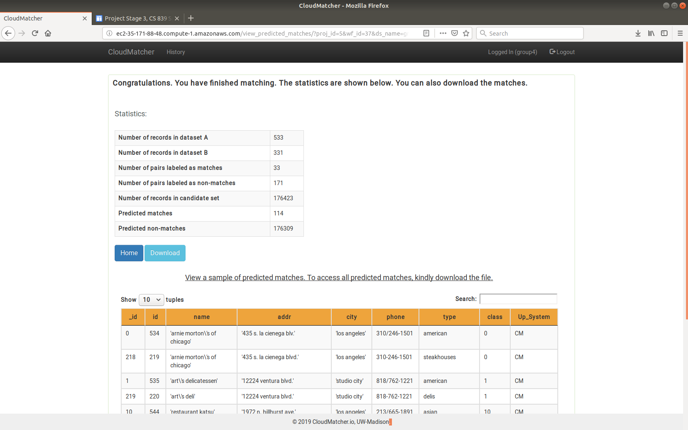
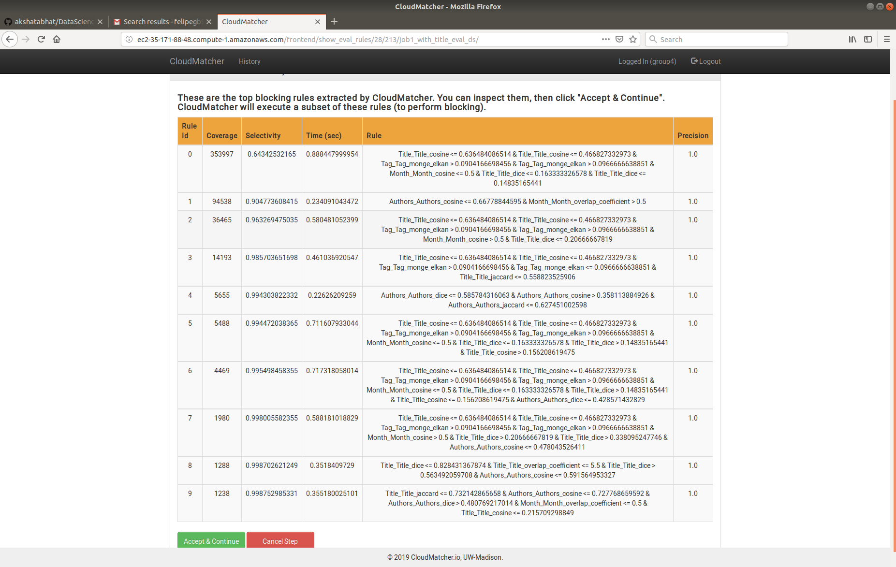
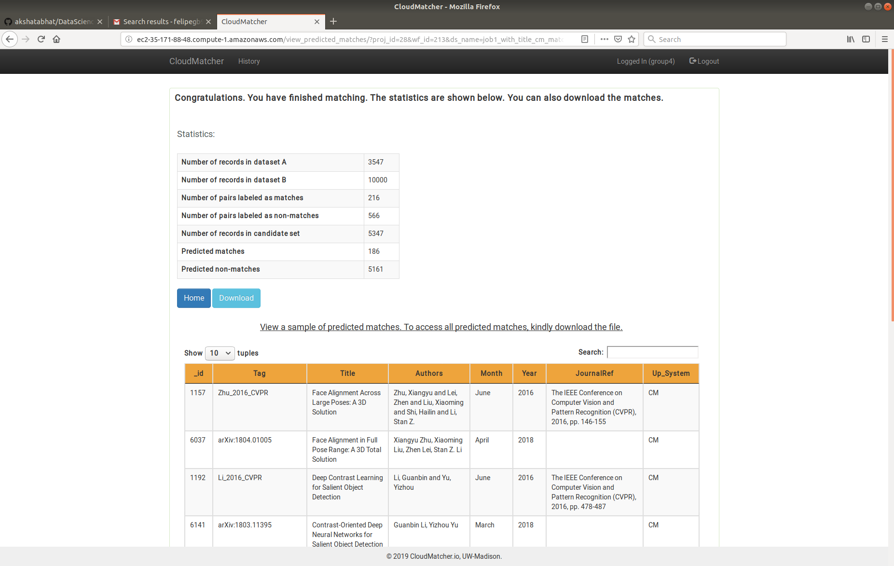

## Webpage for CS839 Project

This repository contains the code, data, and report for the different stages of the Data Science project for CS 839.

**Team:** Akshata Bhat, Pratyush Mahapatra, Felipe Gutierrez Barragan.

**Group ID:** 4.

**Website:** [https://akshatabhat.github.io/DataScience/](https://akshatabhat.github.io/DataScience/)

**Contents:**

1. [Stage 1: Information Extraction Form Text](#stage1)
2. [Stage 2: Crawling and extracting structured data from Web pages](#stage2)
3. [Stage 3](#stage3)
4. [Stage 4](#stage4)
5. [Python Environment Setup](#envsetup)

<hr>
<a name="stage1"></a>

### Stage 1: Information Extraction From Text

**Annotated Documents:** You can find the directory with the annotated documents [here](https://github.com/akshatabhat/DataScience/tree/master/FileRepo_Annotated). Please refer to the [README.md](https://github.com/akshatabhat/DataScience/blob/master/FileRepo_Annotated/README.md) file withing that directory for information on the annotations.

**Browsable Directory for Set I:** [Set I's Browsable Directory Link](https://github.com/akshatabhat/DataScience/tree/master/FileRepo_Annotated/SetI)

**Browsable Directory for Set J:** [Set J's Browsable Directory Link](https://github.com/akshatabhat/DataScience/tree/master/FileRepo_Annotated/SetJ)

**Browsable Directory for Code:** [Code](https://github.com/akshatabhat/DataScience)

**Link to compressed file with all of the above directories:** To download the compressed files you can go to the project repository [here](https://github.com/akshatabhat/DataScience). Then click the green button that says Clone or download. Finally, click on download zip.

**Link to Project Report** [Report](https://github.com/akshatabhat/DataScience/blob/master/CS839_Project1.pdf)

**Link to main function** [main.py](https://github.com/akshatabhat/DataScience/blob/master/src/main.py)

<hr>
<a name="stage2"></a>

### Stage 2:  Crawling and extracting structured data from Web pages

**Data Directory:** [Data](https://github.com/akshatabhat/DataScience/tree/master/stage2/data) . The directory also includes a README file which explains both the tables.

**Code Directory:** [Code](https://github.com/akshatabhat/DataScience/tree/master/stage2/src)

**Stage 2 Report:** [PDF](https://github.com/akshatabhat/DataScience/blob/master/stage2/project_stage2.pdf)

<hr>
<a name="stage3"></a>

### Stage 3: 

**Matching Fodors and Zagats:** 
1. User ID: group4
2. Project ID: stage3_trial
3. Screenshot: 
  

**Blocking Results:** 
1. User ID: group4
2. Project ID: stage3
3. Screenshot: 
  
  
**Matching Results:** 
1. User ID: group4
2. Project ID: stage3
3. Screenshot: 
  
<hr>
<a name="envsetup"></a>

**Precision Recall Results for CloudMatcher's Candidate Set:**
Recall = [0.982813752548643 - 1.0054215415690038]
Precision = [0.9325870283311566 - 0.9451907494466212]

**Precision Recall Results for Candidate Set with OUR Blocking Rule:**
Recall = [0.9941176470588236 - 0.9941176470588236]
Precision = [0.9012651926029382 - 0.9159391084723305]

Take a look at the jupyter_notebook.pdf for the results of all the steps and the code we added to the provided notebook.

**Blocking Rule Description:** Our matching task was to find same papers between arxiv and cvpr. Our blocking rule was to check if the number of authors of both entries was the same. 

**Analysis of Blocking Rules:** 
We observed that the blocking stage in CloudMatcher removed a large number of true matches. We proved this running the debug_blocker on the reduced candidate set (candidate set with our blocking rule). Here we found that most (196 / 200) of the tuple pairs that were true positives had been removed by CloudMatcher. Our own blocking rule removed 4 / 200 of them, because even though the papers seemed to match, their number of authors was different.


### Python Environment Setup

Follow the steps in this section to setup an anaconda virtual environment that contains all the required dependencies/libraries to run the code in this repository.

1. **Install miniconda**
2. **Create anaconda environment:** The following command creates an anaconda environment called `dsenv` with python 3.5.
```conda create -n dsenv python=3.5 ```

3. **Activate environment:** 
```source activate dsenv```

4. **Install libraries:** The code in this repository uses numpy, scipy, pandas, matplotlib, scikit-learn, and ipython (for development). To install all these dependencies run the following command:
```conda install numpy scipy matplotlib ipython pandas scikit-learn```

**Note:** If directly installing the packages with the above commands does not work it is probably because different versions of the libraries were installed. If this happened remove the environment and start over with the following steps.

1. Install miniconda and clone this repository.
2. Navigate to the folder containing this repos.
3. Use the `dsenv.yml` file to create the conda environment by running the following command: 
```conda env create -f dsenv.yml```. 
This command will setup the exact same conda environment we are currently using with all library versions being the same.

For more details on how to manage a conda environment take a look at this webpage: [Managing Conda Environment](https://conda.io/projects/conda/en/latest/user-guide/tasks/manage-environments.html#sharing-an-environment).

